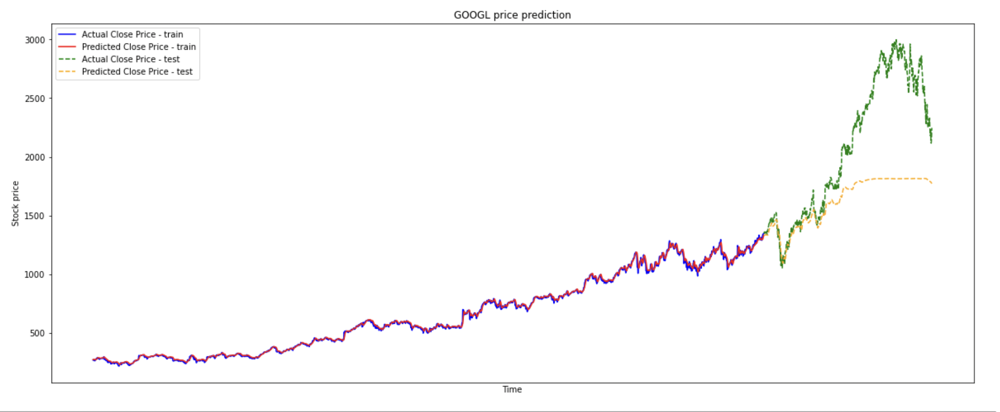

# Stock Price Predictor Using Deep Learning
This project is completed as the final project for the Deep Learning Class for the Master's in Data Science Program at the University of San Francisco.

# Table of Contents
- [Motivation](#motivation)
- [Data](#data)
- [Modelling](#modelling)
- [Results](#results)

# Motivation
**PROBLEM** : The stock market is exciting and a great way to invest and make money. But how to choose which stocks to invest in?
**SOLUTION**: Create a prediction model that helps us understand the performance of stocks in the market and then invest money accordingly.

* A wealth of information is available in the form of historical stock prices and company performance data, suitable for machine learning algorithms to process.
* Investors make educated guesses by analyzing data. They'll read the news, study the company history, industry trends and other data points that go into making a prediction. 
* With no formal background in finance, we are not equipped with enough knowledge to make these decisions.
* As Data Scientists, we can leverage this data and use our skills to whip up an algorithm that can help us with this task.

# Data
We took Google stock data from 2010 - 2022(April) from [Yahoo Finance](https://finance.yahoo.com/). The API returns the Closing price, Starting price and the Volume of stocks, traded for each day.

# Modelling
This project utilizes Deep Learning models, Long-Short Term Memory (LSTM) Neural Network algorithm, to predict stock prices. For data with timeframes, recurrent neural networks (RNNs) come in handy but recent researches have shown that LSTM, networks are the most popular and useful variants of RNNs. 

We have used PyTorch to build a **LSTM** to predict stock prices using historical closing price and trading volume and visualize both the predicted price values over time and the optimal parameters for the model.

The walkthrough of the code can be found in the **Predict_stock_price.ipynb** jupyter notebook.

# Results

**Numer of epochs**: 800

**MSE on train data**:  0.00013905840751249343 
**MSE on val data**:  0.18504878878593445

**Training time**: 300.1186912059784 seconds
